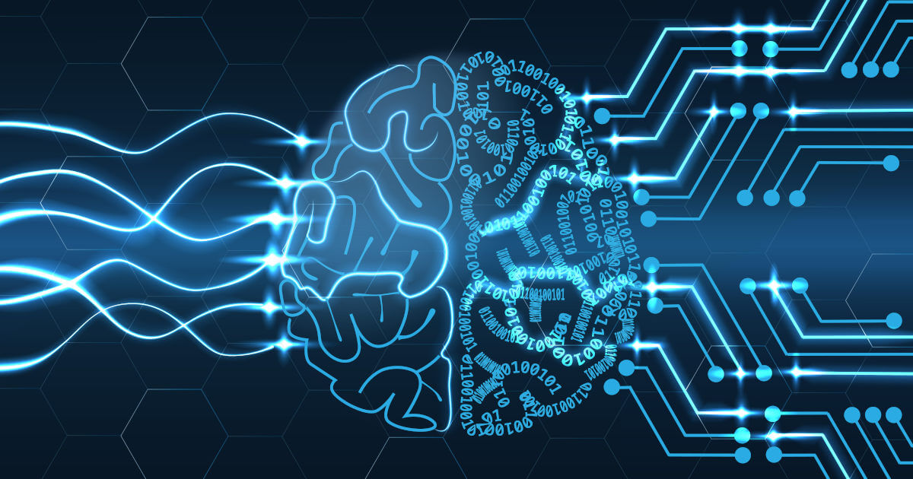
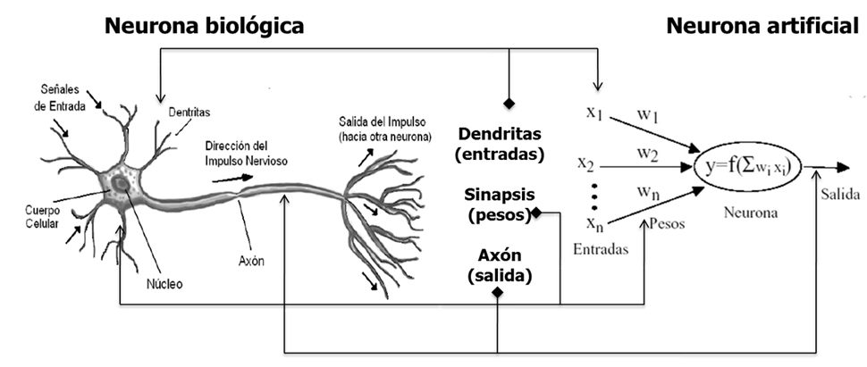
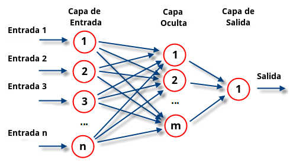
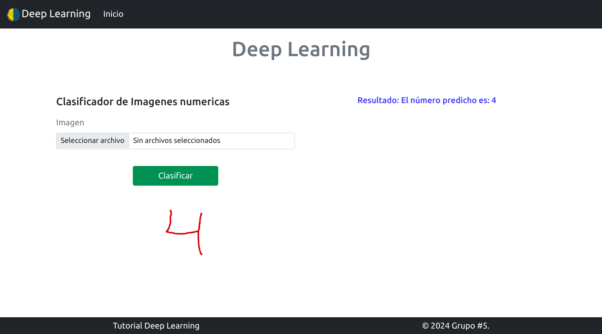

# Deep Learning


## Introducción

El **Deep Learning** es una rama avanzada del **Machine Learning** que se basa en 
redes neuronales artificiales, diseñadas para imitar el comportamiento del cerebro 
humano. Mientras que el Machine Learning tradicional utiliza algoritmos más sencillos 
para aprender a partir de los datos, el Deep Learning emplea múltiples capas de 
neuronas para procesar información de forma más compleja y resolver problemas como 
el reconocimiento de imágenes, la traducción automática, entre otros.

En este contexto, el Deep Learning destaca por su capacidad para **aprender representaciones jerárquicas** 
y abstraer características de datos sin la intervención humana. Su relación con 
el Machine Learning es como una subdisciplina dentro de esta área más amplia. 
En lugar de requerir características predefinidas, como suele ocurrir en el Machine Learning, 
el Deep Learning las extrae automáticamente a medida que entrena los modelos.

Un modelo de entrenamiento es un concepto clave en Machine Learning y Deep Learning, 
que se refiere al proceso y al conjunto de reglas (modelo) que un algoritmo sigue 
para aprender a realizar una tarea específica utilizando datos.

###### ¿Qué es el entrenamiento de un modelo?

El entrenamiento es el proceso mediante el cual un modelo de Machine Learning o 
Deep Learning aprende a partir de un conjunto de datos. Durante el entrenamiento, 
el modelo ajusta sus parámetros internos para mejorar su capacidad de hacer 
predicciones correctas sobre datos nuevos o no vistos.

Este proceso se lleva a cabo a través de varios ciclos de exposición del modelo a 
los datos, durante los cuales ajusta sus parámetros para minimizar el error o 
la diferencia entre las predicciones realizadas por el modelo y las respuestas 
correctas proporcionadas en los datos de entrenamiento.

###### ¿Qué es una predicción en Machine Learning y Deep Learning?

En el contexto de Machine Learning y Deep Learning, el término predicción se 
refiere al proceso de utilizar un modelo entrenado para hacer una estimación o 
suposición informada sobre un valor desconocido o sobre una nueva entrada de datos.

###### ¿Qué es una Red Neuronal Artificial (RNA)?

Las neuronas son pequeñas unidades que procesan información. Las capas son 
conjuntos de neuronas organizadas de forma jerárquica.



En base a estos conceptos, una red neuronal artificial (RNA) es un conjunto de 
capas de neuronas conectadas que permiten al modelo procesar y aprender de los datos.
Una red puede tener muchas capas, cada una de las cuales recibe información de la 
capa anterior y pasa el resultado a la siguiente.

- Capa de entrada: La primera capa, que recibe los datos crudos (como imágenes o texto).
- Capas ocultas: Las capas intermedias, donde se lleva a cabo la mayor parte del procesamiento. En redes profundas, hay muchas capas ocultas.
- Capa de salida: La capa final que genera la predicción o el resultado.



Cada neurona en una capa está conectada a todas las neuronas de la siguiente capa. 
A medida que la información pasa por estas capas, la red aprende a extraer 
características y hacer predicciones.

###### Red Neuronal Artificial (RNA)
Una red neuronal artificial es un conjunto de capas de neuronas conectadas que 
permiten al modelo procesar y aprender de los datos. Las redes pueden ser simples 
(con una sola capa) o complejas (con múltiples capas), como las redes profundas 
(Deep Neural Networks) usadas en Deep Learning.

### Arquitecturas de redes neuronales
- Perceptrón Multicapa (MLP)
La arquitectura más básica, consiste en capas totalmente conectadas (capas densas) entre una capa de entrada y una capa de salida, con una o varias capas ocultas en el medio.
Son usadas para problemas de clasificación y regresión. Es efectivo en datos estructurados o problemas donde la relación entre las variables no es espacial o secuencial.

- Redes Neuronales Convolucionales (CNN)
Utiliza capas que aplican filtros para detectar patrones locales en los datos (por ejemplo, bordes, texturas). Las CNN pueden capturar relaciones espaciales en los datos, como en imágenes.
Son usadas para visión por computadora (clasificación de imágenes, detección de objetos, segmentación de imágenes). También en aplicaciones de procesamiento de audio.

- Redes Neuronales Recurrentes (RNN)
Son usadas para procesar datos secuenciales, donde el orden de los datos es importante. Tienen conexiones recurrentes que permiten que la salida de una capa alimente la siguiente, lo cual es útil para capturar dependencias temporales. Son usadas para el procesamiento de lenguaje natural (NLP), traducción automática, reconocimiento de voz,

- Transformers
En lugar de procesar secuencialmente, los Transformers aplican atención a todos los elementos de la secuencia a la vez.
Son usadas para el procesamiento de lenguaje natural, incluyendo traducción, resumen de texto y chatbots avanzados como GPT (Generative Pre-trained Transformers).

## Descripción del proyecto

En este ejemplo práctico, desarrollamos un sistema capaz de **predecir** un número 
escrito a mano el cual se le toma un fotografia para utilizarla en un modelo 
de Deep Learning entrenado con el conjunto de datos MNIST. La interfaz permite 
cargar una imagen que contiene un dígito, y el modelo la procesa para realizar 
una **predicción** del número representado en la imagen.

## Objetivo del proyecto

El objetivo principal es mostrar cómo un modelo de Deep Learning, después de 
ser entrenado,como puede realizar **predicciones** sobre datos nuevos, 
es decir, tomar una entrada desconocida y ofrecer una salida en base al 
conocimiento adquirido durante el entrenamiento.



### Librerias

- Tensorflow

    - Descripción:

    
        TensorFlow es una biblioteca de código abierto diseñada para realizar cálculos 
        numéricos utilizando gráficos de flujo de datos. Es ampliamente utilizada para 
        construir y entrenar modelos de Machine Learning y Deep Learning.


    - Instalación: 


        ``` 
           pip install tensorflow
        ```

- Pillow

    - Descripción:


        Pillow es una biblioteca de manipulación de imágenes en Python que permite abrir, 
        manipular y guardar imágenes en varios formatos. Es útil para aplicaciones que 
        requieren procesamiento de imágenes, como redimensionar, recortar, rotar, o 
        convertir imágenes entre formatos. 


    - Instalación: 


        ``` 
            pip install django pillow
        ```

### Entrenamiento del modelo

Creamos una archivo con la configuración que contiene el entrenamiento del modelo y lo ejecutamos. 
Este generara un archivo (mnist_model.h5), con el entrenamiento para identificar numeros en una imagen.

``` 
python train_model.py
``` 

#### Codigo de entrenamiento

- Importar las bibliotecas necesarias

  ``` 
    import tensorflow as tf
    from tensorflow.keras.datasets import mnist
    from tensorflow.keras.models import Sequential
    from tensorflow.keras.layers import Dense, Flatten, Dropout
  ``` 

    * **tensorflow:**

          Es una biblioteca de código abierto utilizada para construir y entrenar 
          modelos de machine learning y deep learning.

    * **tensorflow.keras.datasets:**

          Proporciona acceso a diferentes datasets predefinidos, incluido MNIST, 
          un conjunto clásico de imágenes de dígitos escritos a mano (28x28 píxeles).

    * **tensorflow.keras.models.Sequential:** 

          El tipo de modelo que se define como una secuencia de capas, donde cada capa 
          es añadida una después de otra.

    * **tensorflow.keras.layers.Dense:** 

          Capa completamente conectada (fully connected). Cada neurona de esta capa está
          conectada a todas las neuronas de la capa anterior.

    * **tensorflow.keras.layers.Flatten:**

          Convierte las imágenes 2D en un vector unidimensional (una fila de valores) 
          para que puedan ser procesadas por capas densas.

    * **tensorflow.keras.layers.Dropout:**

          Capa que aleatoriamente "apaga" un porcentaje de las neuronas durante el 
          entrenamiento, lo que ayuda a prevenir el sobreajuste (overfitting).

- Cargar el dataset MNIST

  ``` 
    (x_train, y_train), (x_test, y_test) = mnist.load_data()
  ``` 

Descarga el dataset de imágenes MNIST, que contiene imágenes de dígitos del 0 al 9. Devuelve dos tuplas:
      (x_train, y_train) entrenamiento, (x_test, y_test) pruebas

- Preprocesamiento de los datos

  ``` 
    x_train = x_train / 255.0
    x_test = x_test / 255.0
  ``` 

Las imágenes en el dataset son matrices de valores entre 0 y 255 (escala de grises).
Lo que se busca es mejorar el rendimiento al dividirlo se optinen valores de 0 a 1

- Definir el modelo

  ``` 
    model = Sequential([
        Flatten(input_shape=(28, 28)),
        Dense(256, activation='relu'),
        Dropout(0.5),
        Dense(128, activation='relu'),
        Dense(10, activation='softmax')
    ])

  ``` 
**Sequential():** Crea un modelo secuencial, donde las capas se añaden en el orden en que se especifican.

**Flatten(input_shape=(28, 28)):** Convierte cada imagen 2D (28x28 píxeles)

**Dense(256, activation='relu'):** Una capa densa con 256 neuronas. La activación utilizada es ReLU (Rectified Linear Unit), que transforma los valores negativos en ceros, lo que ayuda a introducir no linealidades en la red y acelerar el entrenamiento.

**Dropout(0.5):** Desactiva aleatoriamente el 50% de las neuronas de la capa anterior durante cada paso de entrenamiento, lo que ayuda a prevenir el sobreajuste.

**Dense(128, activation='relu'):** Una segunda capa densa con 128 neuronas y activación ReLU.

**Dense(10, activation='softmax'):** Capa de salida con 10 neuronas, donde cada neurona representa una de las 10 clases (dígitos del 0 al 9). Se usa softmax como función de activación, que convierte las salidas de esta capa en probabilidades (suma de 1), asignando una probabilidad a cada clase.

- Compilar el modelo

  ``` 
    model.compile(optimizer='adam',
                  loss='sparse_categorical_crossentropy',
                  metrics=['accuracy'])

  ``` 

Las imágenes en el dataset son matrices de valores entre 0 y 255 (escala de grises).
Lo que se busca es mejorar el rendimiento al dividirlo se optinen valores de 0 a 1.

**compile():** Prepara el modelo para el entrenamiento definiendo el optimizador.

**optimizer='adam':** El optimizador Adam es uno de los más populares para entrenar redes neuronales, porque ajusta automáticamente ajusta la velocidad de forma inteligente mientras el modelo entrena.

**loss='sparse_categorical_crossentropy':** La función de pérdida que se usa cuando las etiquetas son enteros (numeros 0-9). Cuando entrenamos al modelo, queremos que "aprenda" de sus errores y estamos tratando de clasificar varias categorías (dígitos del 0 al 9).

**metrics=['accuracy']:** Esta calculará la precisión del modelo durante el entrenamiento y la evaluación, lo que significa la proporción de predicciones correctas.

- Entrenar el modelo

  ``` 
    model.fit(x_train, y_train, epochs=10)

  ``` 

**fit():** Inicia el proceso de entrenamiento del modelo utilizando el conjunto de entrenamiento (x_train, y_train).
**epochs=10:** El entrenamiento se realiza en 10 épocas, lo que significa que el modelo verá todo el conjunto de entrenamiento 10 veces.

- Guardar el modelo

  ``` 
    model.save('/home/liwbh/Documentos/ProyectosU/deepLearning/src/classifier/model/mnist_model.h5')
  ``` 

**save():** Guarda el modelo entrenado en un archivo con formato .h5. Este archivo contiene los pesos entrenados del modelo, así como la arquitectura. Esto te permite cargar el modelo más tarde sin tener que volver a entrenarlo.

#### Patrón de entrenamiento


#### Comandos basicos de django

1. Crear entorno virtual
```  
  python -m venv ./venv
```
   
2.  Activar el entorno virtual
windows
```
    .\venv\Scripts\activate
```
Linux
```
    source ./venv/bin/activate
```

3. Crear un proyecto 
```   
    django-admin startproject <my_project>
```  
   
4. Crear una aplicación 
```   
    django-admin startapp <my_app>
```  
   
5. Compilar el proyecto 
```   
    python manage.py runserver
``` 
   
6. Generar archivo requirements.txt, si no lo tenemos o queremos actualizarlo
```   
  pip freeze > requirements.txt
```  
   
7. Install requirements 
```   
  pip install -r requirements.txt
```

8. Crear migraciones 
```   
  python manage.py migrate
```

9. Crear super usuario
```   
    python manage.py createsuperuser
```
   
10. Crear archivos estaticos
```
   python manage.py collectstatic
```  

11. Instalar django
Instalar la última versión disponible
```
   pip install django
```  
Instalar una versión específica de Django
```
   pip install django=x.x.x
```  